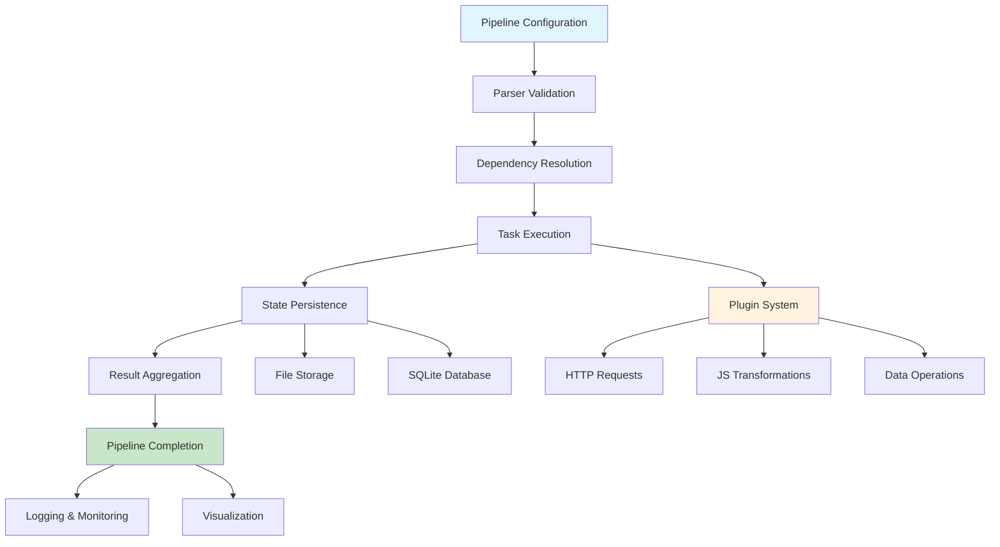

# PipeJS - Data Pipeline Orchestrator


## What is PipeJS?

PipeJS is a lightweight, extensible pipeline orchestrator designed for data processing workflows. It provides a robust framework for defining, executing, and monitoring complex data transformation pipelines with dependency management, error handling, and state persistence.

## Project Overview

PipeJS was created to address the growing need for simple yet powerful data pipeline orchestration in modern applications. Traditional workflow engines are often over-engineered for simple data processing tasks, while custom scripting solutions lack the robustness needed for production environments. PipeJS fills this gap by providing a minimal yet complete pipeline orchestration system.

### Professional Definition

From a professional standpoint, PipeJS is a Directed Acyclic Graph (DAG)-based workflow orchestration system that enables the creation, execution, and monitoring of data processing pipelines. It provides a declarative configuration format, plugin-based extensibility, and production-ready features including state management, error handling, and visualization.

## Aim and Objectives

### Primary Aim
To provide developers and data engineers with a simple, reliable, and extensible framework for building and managing data processing pipelines without the complexity of enterprise-grade workflow systems.

### Core Objectives
- Enable declarative pipeline definition through YAML/JSON configuration
- Provide reliable task execution with dependency resolution
- Support extensibility through a plugin architecture
- Ensure production readiness with proper error handling and state management
- Offer comprehensive monitoring and visualization capabilities
- Maintain simplicity while providing advanced orchestration features

## Project Goals

1. **Simplicity**: Intuitive configuration and easy setup
2. **Reliability**: Robust error handling and state persistence
3. **Extensibility**: Plugin-based architecture for custom functionality
4. **Performance**: Efficient task execution with concurrency control
5. **Visibility**: Comprehensive logging and pipeline visualization
6. **Maintainability**: Clean codebase with full TypeScript support

## How the System Works

PipeJS operates on a core execution model where pipelines are defined as sequences of tasks with explicit dependencies. The system:

1. Parses pipeline configuration files (YAML/JSON)
2. Validates the pipeline structure and task dependencies
3. Executes tasks in dependency-resolved order
4. Manages state across pipeline executions
5. Provides real-time monitoring and logging
6. Handles errors and retries automatically

## User Expectations

Users of PipeJS expect:

- **Declarative Configuration**: Define pipelines without writing code
- **Reliable Execution**: Consistent and predictable pipeline runs
- **Error Resilience**: Automatic retries and graceful failure handling
- **Visibility**: Clear insight into pipeline status and task execution
- **Extensibility**: Ability to add custom functionality through plugins
- **Performance**: Efficient resource utilization and fast execution
- **Maintainability**: Easy to debug, monitor, and update pipelines

## System Components

### Core Engine
- **Parser**: Validates and processes pipeline configuration files
- **Executor**: Manages task execution with dependency resolution
- **Scheduler**: Handles time-based pipeline execution
- **State Manager**: Persists pipeline state and execution history

### Plugin System
- **Plugin Loader**: Dynamic loading of built-in and custom plugins
- **Built-in Plugins**: HTTP requests, JavaScript transformations, data operations
- **Plugin Interface**: Standardized contract for custom plugin development

### CLI Interface
- **Command Handler**: Processes user commands and options
- **Logger**: Structured logging with multiple output formats
- **Visualizer**: Generates pipeline diagrams using Mermaid.js

### Utilities
- **Sandbox**: Secure JavaScript execution environment
- **Notifier**: Event-based notification system
- **Validator**: Configuration and plugin validation

## Component Interactions

```
┌─────────────────┐    ┌──────────────────┐    ┌─────────────────┐
│   CLI Commands  │───▶│   Core Engine    │───▶│  Plugin System  │
└─────────────────┘    └──────────────────┘    └─────────────────┘
         │                       │                       │
         ▼                       ▼                       ▼
┌─────────────────┐    ┌──────────────────┐    ┌─────────────────┐
│  Visualization  │    │  State Manager   │    │   Utilities     │
└─────────────────┘    └──────────────────┘    └─────────────────┘
```

1. **CLI** receives user commands and delegates to appropriate handlers
2. **Core Engine** coordinates pipeline parsing, validation, and execution
3. **Plugin System** provides task execution capabilities
4. **State Manager** persists execution state and history
5. **Utilities** provide supporting functionality like logging and security

## How to Use

### Installation
```bash
git clone <repository>
cd pipejs
npm install
npm run build
```

### Basic Usage

1. **Create a Pipeline Configuration**:
```yaml
pipeline:
  name: "data-processing"
  version: "1.0.0"
  tasks:
    - id: "fetch-data"
      name: "Fetch Data"
      plugin: "http_get"
      config:
        url: "https://api.example.com/data"
    
    - id: "transform-data"
      name: "Transform Data"
      plugin: "js_transform"
      config:
        code: "return data.map(item => ({...item, processed: true}));"
      dependsOn:
        - "fetch-data"
```

2. **Validate the Pipeline**:
```bash
./bin/pipejs validate pipeline.yaml
```

3. **Execute the Pipeline**:
```bash
./bin/pipejs run pipeline.yaml --verbose
```

4. **Visualize the Pipeline**:
```bash
./bin/pipejs visualize pipeline.yaml --format mermaid
```

### Advanced Usage

**Scheduled Execution**:
```bash
./bin/pipejs schedule pipeline.yaml --daemon
```

**Custom Plugins**:
```javascript
// plugins/custom-processor.js
export default {
  name: "custom_processor",
  version: "1.0.0",
  execute: async (config, context) => {
    // Custom processing logic
    return { success: true, output: processedData };
  }
};
```

## Expected Results

### Successful Execution
- Pipeline tasks execute in correct dependency order
- Each task produces expected output
- State is properly persisted between runs
- Comprehensive logs provide execution details
- Final pipeline status reflects successful completion

### Error Handling
- Failed tasks are automatically retried (if configured)
- Dependent tasks are skipped when prerequisites fail
- Detailed error messages help with debugging
- Pipeline state captures failure information

### Monitoring
- Real-time progress updates during execution
- Execution history accessible through state manager
- Visual representations of pipeline structure
- Performance metrics for each task

## Workflow Diagram



## Project Structure

```
pipejs/
├── bin/
│   └── pipejs                          # CLI entry point
├── src/
│   ├── cli/
│   │   ├── commands/
│   │   │   ├── run.ts                  # Pipeline execution command
│   │   │   ├── schedule.ts             # Scheduling command
│   │   │   ├── validate.ts             # Validation command
│   │   │   └── visualize.ts            # Visualization command
│   │   └── index.ts                    # CLI main entry
│   ├── core/
│   │   ├── parser.ts                   # YAML/JSON pipeline parsing
│   │   ├── executor.ts                 # Task execution engine
│   │   ├── scheduler.ts                # Cron-based scheduling
│   │   └── state.ts                    # State management
│   ├── plugins/
│   │   ├── built-in/
│   │   │   ├── http_get.ts             # HTTP request plugin
│   │   │   ├── js_transform.ts         # JavaScript transformation plugin
│   │   │   └── bigquery_load.ts        # Data loading plugin
│   │   └── loader.ts                   # Plugin loading system
│   ├── utils/
│   │   ├── logger.ts                   # Structured logging
│   │   ├── notifier.ts                 # Notification system
│   │   ├── sandbox.ts                  # Secure JS execution
│   │   └── mermaid.ts                  # Visualization generator
│   └── types.ts                        # TypeScript definitions
├── templates/                          # Example pipelines
├── docs/                               # Documentation
├── tests/                              # Test suites
├── package.json
└── tsconfig.json
```

## Key Features

### Pipeline Definition
- YAML/JSON configuration format
- Declarative task dependencies
- Configurable retry policies
- Environment variable support

### Execution Engine
- Dependency-aware task scheduling
- Concurrent execution with limits
- Timeout handling
- Comprehensive error handling

### Plugin Architecture
- Built-in plugins for common tasks
- Custom plugin support
- Plugin validation and security
- Dynamic plugin loading

### State Management
- File-based and SQLite storage
- Execution history tracking
- State cleanup and retention
- Pipeline run persistence

### Monitoring & Visualization
- Structured logging
- Pipeline visualization
- Execution metrics
- Real-time progress tracking

## Conclusion

PipeJS successfully addresses the need for a lightweight, yet powerful pipeline orchestration system. By combining a simple configuration format with robust execution capabilities, it enables developers and data engineers to build reliable data processing workflows without the overhead of complex enterprise systems.

The system's plugin-based architecture ensures extensibility, while its comprehensive feature set provides production-ready capabilities. The clear separation of concerns between configuration, execution, and state management makes PipeJS both maintainable and scalable for various use cases.

## License

MIT License

Copyright (c) 2024 PipeJS Contributors

Permission is hereby granted, free of charge, to any person obtaining a copy
of this software and associated documentation files (the "Software"), to deal
in the Software without restriction, including without limitation the rights
to use, copy, modify, merge, publish, distribute, sublicense, and/or sell
copies of the Software, and to permit persons to whom the Software is
furnished to do so, subject to the following conditions:

The above copyright notice and this permission notice shall be included in all
copies or substantial portions of the Software.

THE SOFTWARE IS PROVIDED "AS IS", WITHOUT WARRANTY OF ANY KIND, EXPRESS OR
IMPLIED, INCLUDING BUT NOT LIMITED TO THE WARRANTIES OF MERCHANTABILITY,
FITNESS FOR A PARTICULAR PURPOSE AND NONINFRINGEMENT. IN NO EVENT SHALL THE
AUTHORS OR COPYRIGHT HOLDERS BE LIABLE FOR ANY CLAIM, DAMAGES OR OTHER
LIABILITY, WHETHER IN AN ACTION OF CONTRACT, TORT OR OTHERWISE, ARISING FROM,
OUT OF OR IN CONNECTION WITH THE SOFTWARE OR THE USE OR OTHER DEALINGS IN THE
SOFTWARE.